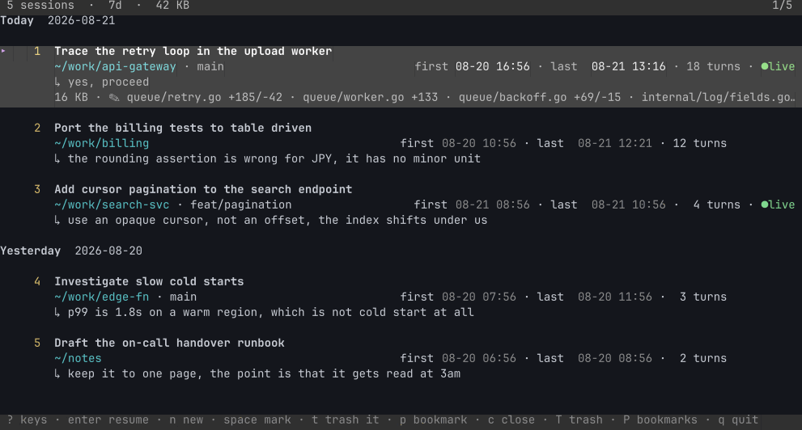

# claude-session-manager

Find and resume any Claude Code session on your machine. The command is `cs`.

Claude Code writes a transcript for every session under `~/.claude/projects`, but its own picker shows only the sessions from the directory you start it in. This tool shows all of them, and puts the last prompt you typed on each row. That line is what tells you where you stopped.



Each row carries the session's title, where it ran, and the last prompt you typed. The highlighted row gains a fourth line: the size on disk, then the files that session changed. `●live` means the process still runs, checked against `/proc` rather than against a status the session wrote about itself.

The recording above uses invented sessions. See [docs/demo](docs/demo) to regenerate it.

## Install

Download a binary from the [releases page](https://github.com/jesseorr/claude-session-manager/releases):

```bash
chmod +x cs-linux-amd64
mv cs-linux-amd64 ~/.local/bin/cs
```

Or build it with Go 1.26 or later:

```bash
go install github.com/jesseorr/claude-session-manager@latest
mv ~/go/bin/claude-session-manager ~/go/bin/cs
```

## Use

Run `cs`. Press `?` for the full key list.

| Key | Action |
|---|---|
| `enter` | Resume the session, in the directory it ran in |
| `f` | Resume as a fork, leaving the original transcript unchanged |
| `n` | Start a new session, in a directory it suggests or one you type |
| `v` | Show every prompt you typed |
| `R` | Rename. The name also appears in `claude --resume` |
| `c` | Close a running session |
| `/` `ctrl+/` | Filter the list, or search inside the transcripts |
| `w` `s` `h` | Time window, sort order, current directory only |
| `space` `A` | Mark a row, or mark every row in view |

Marked rows are what the verbs act on. If nothing is marked, they act on the highlighted row.

### Trash and bookmarks

A capital letter opens a view. The same letter in lower case is the verb that fills it, and inside the view that letter takes things back out.

| Key | View | Verb |
|---|---|---|
| `T` | Trash | `t` sends a session there, or restores it |
| `P` | Bookmarks | `p` adds a bookmark, or removes one |

`esc` steps back out, one layer per press.

Trashed sessions move to `~/.claude/.cs-trash`. Nothing is destroyed until you press `D` on a trashed session, or `ctrl+t` to empty the trash. Both ask first.

## Notes

The tool makes no network calls. It reads your transcripts, and it changes files under `~/.claude` in four ways. It writes your view settings to `cs-prefs.json` and your bookmarks to `cs-pins.json`. A rename appends one title line to that session's transcript. Trashing a session moves the transcript into `.cs-trash`. Finally, it deletes records under `sessions/` once the process they describe has exited.

It runs on Linux and macOS. The `●live` marker, `c`, and `ctrl+g` need `/proc`. On macOS the live marker stays off, and those two keys report that they are unavailable rather than acting on a guess.

A few options exist for scripts. `cs --trash` lists what you discarded, `cs --restore ID` puts one back without opening the interface, and `cs -v` prints the version. `cs -h` lists the rest.

The transcript format belongs to Claude Code, and its documentation states that the format changes between releases. A Claude Code update can therefore break the parts of this tool that read a transcript. Those parts fail by showing less, not by damaging your history.

## Licence

MIT. See [LICENSE](LICENSE).
